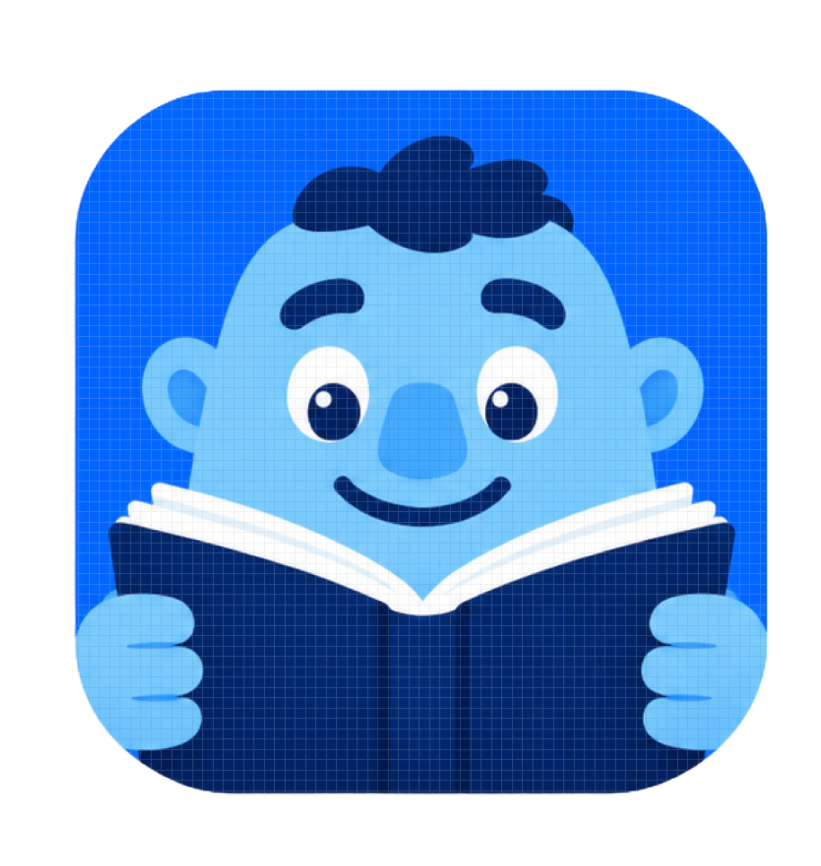

# Word Giant - Dictionary & Vocabulary Learning App

<div align="center">
  
  <p><strong>A comprehensive offline dictionary app with 270K+ words, flashcards, and learning progress tracking</strong></p>
</div>

---

## 📖 Overview

**Word Giant** is a complete Flutter-based dictionary and vocabulary learning application designed for both kids and adults. With over 270,000 words across two dictionaries (Kids Dictionary: 123K words, Standard Dictionary: 146K words), it provides an offline, feature-rich learning experience with progress tracking, flashcards, and personalized study tools.

---

## ✨ Key Features

### 🏠 Home Dashboard
- **Word of the Day**: Daily featured word with full definition
- **Daily Goals**: Set and track daily learning targets (default: 10 words)
- **Streak System**: Track consecutive days of learning 🔥
- **Statistics**: 
  - Words learned today
  - Total words learned (lifetime)
  - Saved words count
- **Quick Access Cards**: Fast navigation to Kids/Standard dictionaries, saved words, and more

### 🔍 Search & Discovery
- **270K+ Words**: Complete offline dictionary database
  - Kids Dictionary: 123,446 words
  - Standard Dictionary: 146,722 words
- **Dual Mode Search**:
  - **Kids Mode**: Simplified definitions, child-friendly language
  - **Standard Mode**: Comprehensive definitions, synonyms, antonyms, frequency bands
- **Recent Searches**: Automatic search history (last 20 searches)
- **Smart Search**: Real-time filtering and results

### 📚 Word Details
- **Pronunciation**: Text-to-speech audio playback
- **Part of Speech**: noun, verb, adjective, etc.
- **Definitions**: 
  - Kid-friendly definitions (Kids mode)
  - Comprehensive definitions (Standard mode)
- **Example Sentences**: Real-world usage examples
- **Synonyms & Antonyms** (Standard mode)
- **Frequency Band**: Word usage frequency (Standard mode)
- **Save/Bookmark**: One-tap saving for later review

### 🎯 Learning & Flashcards
- **Practice Decks**:
  - All Words
  - Saved Words (personalized deck)
  - Kids Dictionary
  - Standard Dictionary
  - Mixed Practice
- **Interactive Flashcards**: Flip to reveal definitions
- **Quiz Scoring**: Track correct/wrong answers
- **Auto-Learning**: Correct answers automatically mark words as learned
- **Progress Tracking**: Visual progress bars and percentages
- **Score History**: Last 50 quiz results saved

### 💾 Saved Words Management
- **Bookmark System**: Save words for later study
- **Learning Status**: 
  - 🟠 To Learn
  - 🟢 Learned
- **Search Within Saved**: Filter your saved words
- **Date Tracking**: See when each word was saved
- **Study All**: Practice all saved words in flashcard mode
- **Persistent Storage**: All saves retained across app restarts

### ⚙️ Settings & Customization
- **Reading Mode**: 
  - Kids Mode (simplified definitions)
  - Standard Mode (comprehensive definitions)
  - Mode preference saved and applied to search
- **General Settings**:
  - Daily reminder notifications
  - Sound effects toggle
  - Auto-play pronunciation
  - Adjustable text size
- **Offline Downloads**: Manage dictionary data
- **Help & Support**: FAQ, contact support
- **Legal**: Privacy Policy, Terms of Service

---

## 🎨 Design & UI

### Color Palette
- **Primary Blue**: `#0066FF` - Navigation, primary actions
- **Purple Gradient**: `#B24BF3` to `#D946EF` - Mode toggles, premium features
- **Orange**: `#FFB347` - Word of the Day, warm accents
- **Green**: `#51CF66` - Success states, learned words
- **Red**: `#FF6B6B` - Saved/favorite indicators
- **Background**: `#F5F7FA` - Clean, readable base

### Custom Navigation
- Custom bottom navigation with active/inactive states
- Blue indicator bar on active tab
- Custom icon assets for each navigation item
- Smooth transitions between screens

---

## 🛠️ Technical Architecture

### Tech Stack
- **Framework**: Flutter (Dart)
- **State Management**: StatefulWidget with setState
- **Local Storage**: SharedPreferences
- **TTS**: flutter_tts (text-to-speech)
- **Data Format**: JSON (270K+ word entries)

### Project Structure
```
lib/
├── main.dart                          # App entry point
├── models/
│   └── word_model.dart               # WordModel, SavedWord, DifficultyLevel
├── data/
│   └── dictionary_data.dart          # Dictionary data loading & search
├── services/
│   └── storage_service.dart          # Local storage management
├── utils/
│   └── app_theme.dart                # App-wide theme & colors
└── screens/
    ├── welcome_screen.dart            # Splash/welcome screen
    ├── main_screen.dart               # Bottom navigation container
    ├── home_screen.dart               # Dashboard with stats
    ├── search_screen.dart             # Word search interface
    ├── word_detail_screen.dart        # Individual word details
    ├── learn_screen.dart              # Flashcard deck selection
    ├── flashcard_screen.dart          # Interactive flashcard quiz
    ├── saved_screen.dart              # Saved words management
    ├── settings_screen.dart           # Settings hub
    ├── general_settings_screen.dart   # App preferences
    ├── offline_downloads_screen.dart  # Download management
    ├── help_faq_screen.dart          # Help documentation
    ├── contact_support_screen.dart    # Support contact
    ├── privacy_policy_screen.dart     # Privacy policy
    └── terms_of_service_screen.dart   # Terms of service

assets/
├── images/                           # App icons, logos, navigation icons
└── data/                            # Dictionary JSON files
    ├── Kids_Dictionary_Final_Refined.json       # 123,446 words
    └── Standard_Dictionary_Final_Refined.json   # 146,722 words
```

### Data Models

#### WordModel
```dart
{
  word: String,
  partOfSpeech: String,
  definition: String,
  kidFriendlyDefinition: String?,
  exampleSentence: String?,
  synonyms: List<String>,
  antonyms: List<String>,
  frequencyBand: String?,
  level: DifficultyLevel (easy/standard)
}
```

#### SavedWord
```dart
{
  word: WordModel,
  savedDate: DateTime,
  status: LearningStatus (toLearn/learned)
}
```

### Local Storage (SharedPreferences)

**Stored Data:**
- `saved_words`: User's bookmarked words
- `learned_words`: Words marked as learned
- `recent_searches`: Search history (last 20)
- `daily_goal`: Learning goal (default: 10)
- `words_learned_today`: Today's count (resets at midnight)
- `streak_count`: Consecutive learning days
- `total_words_learned`: Lifetime count
- `quiz_scores`: Quiz history (last 50)
- `reading_mode`: User's preferred mode (easy/standard)

---

## 🚀 Getting Started

### Prerequisites
- Flutter SDK (3.12.2 or higher)
- Dart SDK
- iOS Simulator / Android Emulator / Physical Device

### Installation

1. **Clone the repository**
```bash
git clone <repository-url>
cd dictionary
```

2. **Install dependencies**
```bash
flutter pub get
```

3. **Run the app**
```bash
# List available devices
flutter devices

# Run on connected device
flutter run

# Run on specific device
flutter run -d <device-id>
```

4. **Build for release**
```bash
# iOS
flutter build ios

# Android
flutter build apk
flutter build appbundle
```

### Dependencies
```yaml
dependencies:
  flutter:
    sdk: flutter
  cupertino_icons: ^1.0.8
  shared_preferences: ^2.2.2
  flutter_tts: ^3.8.5
  intl: ^0.19.0

dev_dependencies:
  flutter_test:
    sdk: flutter
  flutter_lints: ^6.0.0
  flutter_launcher_icons: ^0.13.1
```

---

## 📱 App Screenshots & Features

### Home Screen
- Real word counts from 270K+ word database
- Dynamic daily goal progress
- Streak tracking (consecutive days)
- Clickable Quick Access cards:
  - Kids Dictionary → Navigate to search
  - Standard Dictionary → Navigate to search
  - Saved Words → Navigate to saved screen
  - Total Words → Navigate to search
  - Premium & Visual → Coming soon notifications

### Search Screen
- Easy/Standard mode toggle
- Real-time search results
- Recent searches display
- Reading mode preference applied from settings

### Word Detail Screen
- Full word information display
- Text-to-speech pronunciation
- Save/unsave bookmark button
- Status persists across sessions

### Learn Screen
- Practice deck selection with real stats:
  - All Words (based on daily progress)
  - Saved Words (actual saved count)
  - Kids Dictionary
  - Standard Dictionary
  - Mixed Practice (lifetime learned)
- Visual progress indicators

### Saved Screen
- List of all saved words
- Learning status badges (To Learn / Learned)
- Search within saved words
- Empty state when no words saved
- One-tap access to word details

### Settings Screen
- Reading Mode selector (Kids/Standard)
- Mode preference saved to storage
- General settings access
- Help & support options
- Legal documents

---

## 🎯 Learning Flow

### User Journey Example

1. **First Launch**
   - Welcome screen with app logo
   - Navigate to home dashboard

2. **Daily Learning**
   - View Word of the Day
   - Check daily goal progress
   - Search for new words
   - Save interesting words

3. **Practice Session**
   - Go to Learn screen
   - Choose a practice deck
   - Complete flashcard quiz
   - Correct answers auto-mark as learned
   - Daily goal updates automatically
   - Streak increments

4. **Progress Tracking**
   - Home screen shows real-time stats
   - Streak counter motivates daily use
   - Total learned count grows
   - Saved words accessible anytime

5. **Customization**
   - Settings → Reading Mode
   - Choose Kids or Standard
   - Preference applied to all searches

---

## 💾 Data Persistence

All user data is stored locally using SharedPreferences:

✅ **Persists across app restarts**  
✅ **Persists across device reboots**  
✅ **Fully offline functionality**  
✅ **No internet required**  
✅ **Fast data access**  
✅ **Small storage footprint** (~10-50KB)

---

## 🔮 Future Enhancements

- [ ] Cloud sync for multi-device access
- [ ] Dark mode support
- [ ] Spaced repetition algorithm (SRS)
- [ ] Daily word push notifications
- [ ] Widget support (Word of the Day)
- [ ] Social features (friends, leaderboards)
- [ ] More quiz types (multiple choice, spelling)
- [ ] Audio pronunciation downloads
- [ ] Advanced statistics & charts
- [ ] Export/import functionality
- [ ] Premium features (ad-free, unlimited saves)
- [ ] Multi-language support

---

## 📄 License

Copyright © 2026 Word Giant. All rights reserved.

---

## 🤝 Contributing

This project is currently not open for contributions. For inquiries, please contact the development team.

---

## 📧 Contact & Support

For support, bug reports, or feature requests:
- **In-App**: Settings → Contact Support
- **GitHub Issues**: [Report an issue](link-to-issues)

---

<div align="center">
  <p>Built with ❤️ using Flutter</p>
  <p><strong>Word Giant</strong> - Dictionary that grows with you</p>
</div>
